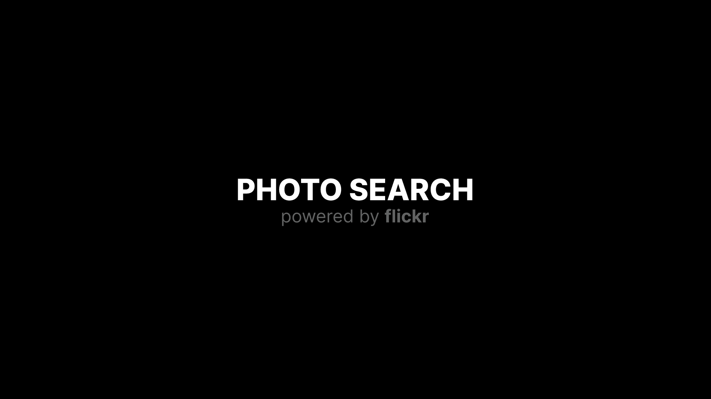

# PhotoSearch

[](https://kotlinlang.org)


## What's PhotoSearch? :rocket:
PhotoSearch is an Android TV app using Jetpack Compose UI.
The purpose of this project is to try new Android technologies and learn how it works in a TV app.</br>
The data is fetched from <a href='https://www.flickr.com/services/api/'>Flickr API</a>.</br>

## Screenshots ✨
&emsp;

## Get Your Flickr API Key 🔑

In order to fetch data from Flickr you'll need to get your API Key from the following URL: [https://www.flickr.com/services/apps/create/apply/?](https://www.flickr.com/services/apps/create/apply/?)<br>

Now that you have a key you'll need to include it in `apikey.properties`

```
flickrKey=\"YOUR_API_KEY\"
userId=\"YOUR_FLICKR_USER_ID\"
```

## License
```
Copyright 2022 The Android Open Source Project

Licensed under the Apache License, Version 2.0 (the "License");
you may not use this file except in compliance with the License.
You may obtain a copy of the License at

    https://www.apache.org/licenses/LICENSE-2.0

Unless required by applicable law or agreed to in writing, software
distributed under the License is distributed on an "AS IS" BASIS,
WITHOUT WARRANTIES OR CONDITIONS OF ANY KIND, either express or implied.
See the License for the specific language governing permissions and
limitations under the License.
```